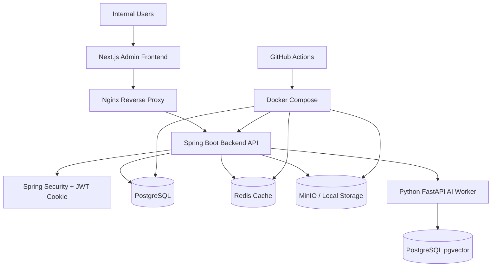
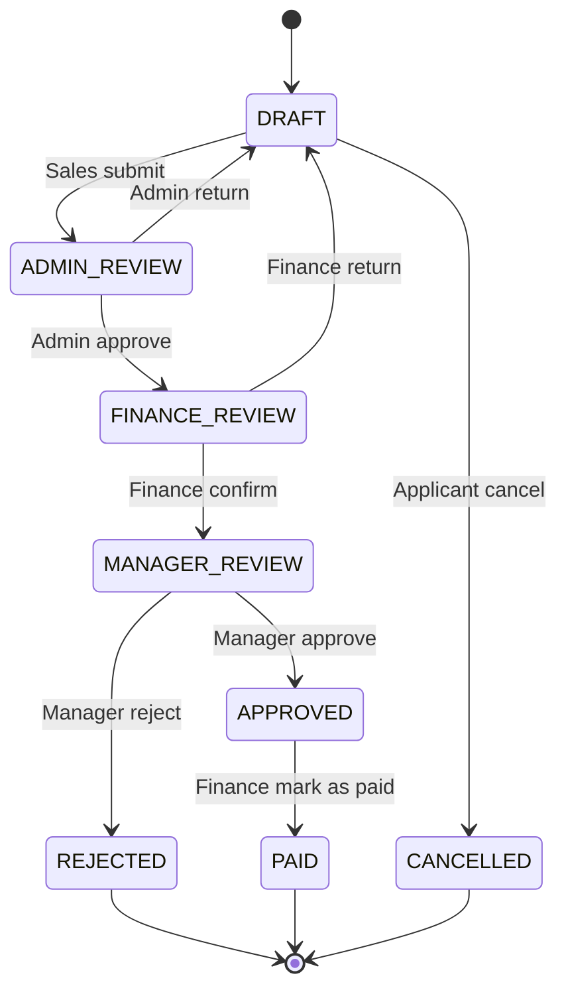
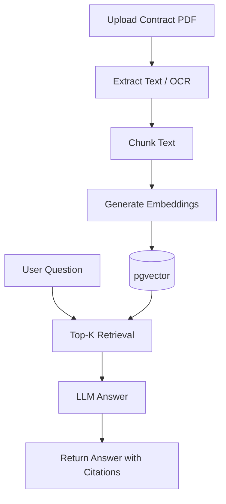

# ContractFlow 專案架構書

> B2B 合約與退費審核 SaaS 平台  
> Project Architecture Document

---

## 1. 專案概述

### 1.1 專案名稱

**ContractFlow**  
B2B 合約與退費審核 SaaS 平台

---

### 1.2 專案定位

ContractFlow 是一套面向中小企業的 B2B 合約與退費審核 SaaS 平台，主要解決企業在客戶取消合作、退費申請、合約文件審核、跨部門簽核與退款追蹤上的流程混亂問題。

本系統將不同企業原本分散在 Google 表單、Google Sheet、Email、LINE、紙本文件與人工溝通中的流程，整合成一套具備以下能力的多租戶 SaaS 平台：

- Organization / Workspace 多租戶資料隔離
- 組織成員邀請、角色分派與權限控管
- 多角色登入與權限控管
- B2B 客戶與專案資料管理
- 合約與退費案件管理
- 多階段審核流程
- 案件狀態追蹤
- 操作紀錄與 Audit Log
- 文件上傳與管理
- Dashboard 統計分析
- AI 合約搜尋與案件摘要
- Docker 化部署與 CI/CD

---

### 1.3 專案目標

本專案的核心目標不是單純製作 CRUD 系統，而是建立一個能展現後端工程能力的 SaaS 化企業流程系統。

主要目標如下：

1. 建立一套可追蹤、可審核、可維護的多租戶 SaaS 流程系統。
2. 將 B2B 合約、退費、審核、文件與通知整合在同一平台。
3. 使用 Organization + RBAC 權限控管不同企業與不同部門角色的操作範圍。
4. 使用狀態機設計退費審核流程，避免非法流程操作。
5. 使用 Tenant-aware Audit Log 記錄所有重要操作，滿足企業內部稽核與 SaaS 客戶資料隔離需求。
6. 使用 PostgreSQL、Redis、Docker、GitHub Actions 等技術建立接近真實產品的後端系統。
7. 第二階段導入 AI / RAG，支援合約文件搜尋、案件摘要與缺件提醒。

---

## 2. 問題背景

### 2.1 現有流程痛點

許多中小企業或行銷公司在處理 B2B 客戶取消合作與退費流程時，常見作業方式如下：

- 業務使用 Google 表單填寫退費需求
- 內勤人員人工查詢客戶資料與合約資料
- 財務人員透過 Email 或 LINE 確認退款金額
- 主管透過訊息或紙本進行審核
- 文件分散在雲端硬碟、Email、聊天紀錄與本機資料夾
- 最後再由人工統整退費狀態與退款結果

這種流程容易產生以下問題：

| 問題 | 說明 |
|---|---|
| 流程不透明 | 不知道案件目前卡在哪一關 |
| 權限不明確 | 不同人員可能看到或修改不該操作的資料 |
| 文件分散 | 合約、退款證明、對話紀錄難以集中管理 |
| 操作無紀錄 | 無法追蹤誰修改了狀態或金額 |
| 多客戶隔離困難 | 若要服務多間企業，必須避免資料互相外洩 |
| 統計困難 | 很難分析退費原因、金額與處理時間 |
| 查詢效率低 | Google Sheet 或人工搜尋容易耗時 |
| 缺乏自動提醒 | 案件容易因為人員忘記處理而延遲 |

---

### 2.2 系統解決方向

ContractFlow 透過 SaaS 化流程管理，將每個 Organization 的 B2B 退費與合約審核流程轉換為：

```text
案件建立 → 文件上傳 → 內勤審核 → 財務確認 → 主管核准 → 退款完成 → 統計分析
```

系統會記錄每個階段的狀態、負責人、操作時間與備註，並以 `organization_id` 隔離資料，讓每間企業都只能存取自己的客戶、合約、案件、文件與 Audit Log。

---

## 3. 使用者角色與權限

### 3.1 角色設計

| 角色 | 說明 | 主要權限 |
|---|---|---|
| Owner | 組織擁有者 | 管理組織設定、成員邀請、角色分派、訂閱方案 |
| Sales | 業務人員 | 建立退費案件、查看自己的案件、上傳文件 |
| Admin | 內勤人員 | 審核案件資料、退回補件、管理客戶與專案資料 |
| Finance | 財務人員 | 確認退款金額、審核付款資訊、標記退款完成 |
| Manager | 主管 | 最終核准或拒絕退費案件、查看統計報表 |
| System Admin | 平台管理員 | SaaS 平台維運、方案設定、支援與稽核 |

---

### 3.2 RBAC 權限矩陣

| 功能 | Owner | Sales | Admin | Finance | Manager | System Admin |
|---|---:|---:|---:|---:|---:|---:|
| 建立退費案件 | ✅ | ✅ | ✅ | ❌ | ❌ | ✅ |
| 查看自己的案件 | ✅ | ✅ | ✅ | ✅ | ✅ | ✅ |
| 查看組織全部案件 | ✅ | ❌ | ✅ | ✅ | ✅ | ✅ |
| 編輯草稿案件 | ✅ | ✅ | ✅ | ❌ | ❌ | ✅ |
| 內勤審核 | ✅ | ❌ | ✅ | ❌ | ❌ | ✅ |
| 財務審核 | ✅ | ❌ | ❌ | ✅ | ❌ | ✅ |
| 主管核准 | ✅ | ❌ | ❌ | ❌ | ✅ | ✅ |
| 標記退款完成 | ✅ | ❌ | ❌ | ✅ | ❌ | ✅ |
| 查看 Dashboard | ✅ | ❌ | ✅ | ✅ | ✅ | ✅ |
| 管理組織成員 | ✅ | ❌ | ❌ | ❌ | ❌ | ✅ |

---

### 3.3 SaaS 多租戶模型

MVP 採用 shared database / shared schema 的多租戶設計。所有 tenant-owned resource 都帶 `organization_id`，後端所有查詢與寫入都必須以目前使用者所在 Organization 作為 scope。

```text
User -> OrganizationMember -> Role -> Permission
```

設計原則：

1. 同一個 User 可以加入多個 Organization。
2. 同一個 User 在不同 Organization 可以有不同角色。
3. 前端需提供 Organization switcher，API 以 `/api/orgs/{orgId}/...` 表示目前租戶 context。
4. Service / Repository 不允許查詢未帶 `organization_id` 的 tenant resource。
5. Audit Log 必須記錄 `organization_id`，平台級操作可允許為空。

---

## 4. 核心功能範圍

## 4.1 MVP 功能

第一版 MVP 目標是完成一套可登入、可建立組織、可依組織角色審核、可追蹤紀錄的 SaaS 後端系統。

MVP 不追求一次完成所有 SaaS 商業功能，優先把多租戶資料隔離與企業流程核心做穩，讓專案能清楚展示後端工程能力。

### MVP 必做功能

1. 使用者登入與組織切換
2. Organization 建立、成員邀請與角色權限
3. Tenant-aware 客戶資料管理
4. Tenant-aware 專案與合約資料管理
5. 退費案件建立
6. 退費案件審核流程
7. 案件狀態紀錄
8. 操作紀錄 Audit Log
9. 案件查詢與篩選

### MVP 可延後功能

以下功能可在核心流程穩定後再實作，避免第一版範圍過大：

1. 文件上傳與下載
2. Dashboard 統計
3. Redis 快取
4. 站內通知與 Email 通知
5. 訂閱方案、用量限制與 Billing 整合
6. Docker Compose 部署整合
7. Testcontainers 整合測試
8. AI / RAG 功能

---

## 4.2 第二階段功能

第二階段目標是讓系統更接近可營運的 SaaS 產品。

1. Redis 快取 Dashboard 統計資料
2. 站內通知系統
3. Email 通知
4. Subscription plan 與用量限制
5. Billing provider 串接
6. Testcontainers 整合測試
7. GitHub Actions CI/CD
8. Docker Compose 一鍵啟動
9. Nginx 反向代理部署
10. AI 合約文件搜尋
11. AI 案件摘要
12. AI 缺件提醒

---

## 5. 系統架構

### 5.1 整體架構圖



---

### 5.2 後端分層架構

```text
Controller Layer
    ↓
Application Service Layer
    ↓
Domain / Business Logic Layer
    ↓
Repository Layer
    ↓
Database
```

### 分層說明

| Layer | 責任 |
|---|---|
| Controller | 接收 HTTP 請求、驗證 Request、回傳 Response |
| Service | 處理商業邏輯、交易控制、流程操作 |
| Domain | 狀態轉換規則、業務規則、Entity 行為 |
| Repository | 資料庫存取 |
| DTO / VO | API 請求與回應資料結構 |
| Mapper | Entity 與 DTO 轉換 |

---

## 6. 技術選型

### 6.1 後端技術

| 技術 | 用途 |
|---|---|
| Java 17 | 主要後端語言 |
| Spring Boot | 後端框架 |
| Spring Security | 登入驗證與權限控管 |
| Spring Data JPA | ORM 與資料存取 |
| PostgreSQL | 主資料庫 |
| Redis | 快取與暫存資料 |
| Flyway | 資料庫版本控管 |
| JUnit 5 | 單元測試 |
| Mockito | Mock 測試 |
| Testcontainers | 整合測試資料庫環境 |
| Docker | 容器化部署 |
| GitHub Actions | CI/CD |

---

### 6.2 前端技術

| 技術 | 用途 |
|---|---|
| Next.js | React 全端框架、App Router、前端建置 |
| React | 後台管理介面 UI |
| TypeScript | 型別安全與前端可維護性 |
| Tailwind CSS | Utility-first 樣式系統 |
| shadcn/ui | 後台 UI 元件基礎 |
| TanStack Query | API 查詢、快取與 loading/error 狀態管理 |
| React Hook Form | 表單狀態管理 |
| Zod | 表單與 API schema 驗證 |
| Fetch / Axios | API 呼叫 |

前端定位為 SaaS 後台工作台，主要採用 Client Components 實作互動頁面。Next.js 的 SSR 能力可保留，但 MVP 不依賴 SSR；先以穩定的組織切換、表格、表單、篩選與審核操作為主。

---

### 6.3 AI Worker 技術

| 技術 | 用途 |
|---|---|
| Python FastAPI | AI Worker API |
| pgvector | 向量資料儲存 |
| OCR / PDF Parser | 文件內容抽取 |
| Embedding Model | 文件向量化 |
| RAG | 合約問答與案件摘要 |

---

## 7. 後端模組規劃

### 7.1 模組列表

| 模組 | 說明 |
|---|---|
| auth | 登入、登出、JWT、Refresh Token、使用者身份 |
| organizations | 組織、成員、邀請、租戶 context |
| users | 使用者管理、角色管理 |
| clients | B2B 客戶資料管理 |
| projects | 專案與合約資料管理 |
| refunds | 退費案件與審核流程 |
| files | 文件上傳、下載、檔案權限 |
| notifications | 站內通知、Email 通知 |
| dashboard | 統計資料與圖表 API |
| audit | 操作紀錄與狀態紀錄 |
| subscriptions | 訂閱方案與組織方案狀態 |
| ai | AI 文件搜尋、案件摘要 |
| common | 共用回應格式、錯誤處理、工具類 |

---

### 7.2 建議專案目錄

```text
contractflow-backend/
├── src/
│   ├── main/
│   │   ├── java/com/contractflow/
│   │   │   ├── ContractFlowApplication.java
│   │   │   ├── common/
│   │   │   │   ├── response/
│   │   │   │   ├── exception/
│   │   │   │   ├── security/
│   │   │   │   └── util/
│   │   │   ├── auth/
│   │   │   │   ├── controller/
│   │   │   │   ├── service/
│   │   │   │   ├── dto/
│   │   │   │   └── security/
│   │   │   ├── organizations/
  │   │   │   ├── users/
│   │   │   ├── clients/
│   │   │   ├── projects/
│   │   │   ├── refunds/
│   │   │   │   ├── controller/
│   │   │   │   ├── service/
│   │   │   │   ├── entity/
│   │   │   │   ├── repository/
│   │   │   │   ├── dto/
│   │   │   │   └── domain/
│   │   │   ├── files/
│   │   │   ├── notifications/
│   │   │   ├── dashboard/
│   │   │   ├── audit/
│   │   │   ├── subscriptions/
│   │   │   └── ai/
│   │   └── resources/
│   │       ├── application.yml
│   │       └── db/migration/
│   └── test/
│       └── java/com/contractflow/
├── Dockerfile
├── docker-compose.yml
├── pom.xml
└── README.md
```

---

## 8. 主要資料表設計

### 8.1 SaaS 租戶

```text
organizations
organization_members
organization_invitations
subscription_plans
organization_subscriptions
```

#### organizations

| 欄位 | 型別 | 說明 |
|---|---|---|
| id | BIGSERIAL | 組織 ID |
| name | VARCHAR(255) | 組織名稱 |
| slug | VARCHAR(100) | 對外識別碼，唯一 |
| status | VARCHAR(20) | ACTIVE / SUSPENDED |
| billing_email | VARCHAR(255) | 帳務 Email |
| created_at | TIMESTAMP | 建立時間 |
| updated_at | TIMESTAMP | 更新時間 |

#### organization_members

| 欄位 | 型別 | 說明 |
|---|---|---|
| id | BIGSERIAL | 成員 ID |
| organization_id | BIGINT | 組織 ID |
| user_id | BIGINT | 使用者 ID |
| role_id | BIGINT | 此使用者在該組織的角色 |
| status | VARCHAR(20) | ACTIVE / INVITED / DISABLED |
| invited_by | BIGINT | 邀請人 |
| joined_at | TIMESTAMP | 加入時間 |
| created_at | TIMESTAMP | 建立時間 |
| updated_at | TIMESTAMP | 更新時間 |

#### organization_invitations

| 欄位 | 型別 | 說明 |
|---|---|---|
| id | BIGSERIAL | 邀請 ID |
| organization_id | BIGINT | 組織 ID |
| email | VARCHAR(255) | 被邀請 Email |
| role_id | BIGINT | 邀請角色 |
| token_hash | VARCHAR(255) | 邀請 token hash |
| status | VARCHAR(20) | PENDING / ACCEPTED / EXPIRED / CANCELLED |
| expires_at | TIMESTAMP | 到期時間 |
| invited_by | BIGINT | 邀請人 |
| accepted_by | BIGINT | 接受邀請的使用者 |
| created_at | TIMESTAMP | 建立時間 |
| accepted_at | TIMESTAMP | 接受時間 |

#### subscription_plans / organization_subscriptions

`subscription_plans` 定義方案與限制，`organization_subscriptions` 記錄每個 Organization 目前使用的方案、狀態與週期。MVP 可先建立 schema，不急著串接付款。

### 8.2 使用者與權限

```text
users
roles
permissions
user_roles
role_permissions
refresh_tokens
login_audit_logs
```

SaaS 化後，租戶內角色以 `organization_members.role_id` 為主；`user_roles` 僅保留給平台層級角色、系統初始化或相容既有 RBAC 設計。

#### users

| 欄位 | 型別 | 說明 |
|---|---|---|
| id | BIGSERIAL | 使用者 ID |
| email | VARCHAR(255) | Email，唯一 |
| password_hash | VARCHAR | 密碼雜湊 |
| name | VARCHAR(100) | 姓名 |
| status | VARCHAR(20) | ACTIVE / DISABLED |
| version | BIGINT | JPA optimistic locking |
| created_at | TIMESTAMP | 建立時間 |
| updated_at | TIMESTAMP | 更新時間 |

#### roles

| 欄位 | 型別 | 說明 |
|---|---|---|
| id | BIGSERIAL | 角色 ID |
| code | VARCHAR(50) | 角色代碼，例：OWNER / SALES / ADMIN / FINANCE / MANAGER / SYSTEM_ADMIN |
| name | VARCHAR(100) | 角色名稱 |
| description | VARCHAR(255) | 說明 |
| created_at | TIMESTAMP | 建立時間 |
| updated_at | TIMESTAMP | 更新時間 |

#### permissions

| 欄位 | 型別 | 說明 |
|---|---|---|
| id | BIGSERIAL | 權限 ID |
| code | VARCHAR(100) | 權限代碼，例：REFUND_APPROVE_ADMIN |
| name | VARCHAR(100) | 權限名稱 |
| description | VARCHAR(255) | 說明 |
| created_at | TIMESTAMP | 建立時間 |

#### user_roles

| 欄位 | 型別 | 說明 |
|---|---|---|
| user_id | BIGINT | 使用者 ID |
| role_id | BIGINT | 角色 ID |
| created_at | TIMESTAMP | 建立時間 |

#### role_permissions

| 欄位 | 型別 | 說明 |
|---|---|---|
| role_id | BIGINT | 角色 ID |
| permission_id | BIGINT | 權限 ID |
| created_at | TIMESTAMP | 建立時間 |

#### refresh_tokens

| 欄位 | 型別 | 說明 |
|---|---|---|
| id | BIGSERIAL | Refresh Token ID |
| user_id | BIGINT | 使用者 ID |
| token_hash | VARCHAR | Refresh Token 雜湊 |
| revoked | BOOLEAN | 是否已撤銷 |
| expires_at | TIMESTAMP | 到期時間 |
| created_at | TIMESTAMP | 建立時間 |

#### login_audit_logs

| 欄位 | 型別 | 說明 |
|---|---|---|
| id | BIGSERIAL | 紀錄 ID |
| user_id | BIGINT | 使用者 ID，可為空 |
| email | VARCHAR(255) | 嘗試登入的 Email |
| success | BOOLEAN | 是否成功 |
| failure_reason | VARCHAR(255) | 失敗原因 |
| ip_address | VARCHAR(45) | IP |
| user_agent | TEXT | User Agent |
| created_at | TIMESTAMP | 建立時間 |

---

### 8.3 客戶與專案

```text
clients
projects
contracts
```

#### clients

| 欄位 | 型別 | 說明 |
|---|---|---|
| id | BIGSERIAL | 客戶 ID |
| organization_id | BIGINT | 組織 ID |
| company_name | VARCHAR(255) | 公司名稱 |
| tax_id | VARCHAR(20) | 統一編號，同一組織內唯一 |
| contact_name | VARCHAR(100) | 聯絡人 |
| contact_email | VARCHAR(255) | 聯絡人 Email |
| contact_phone | VARCHAR(50) | 聯絡電話 |
| status | VARCHAR(20) | ACTIVE / INACTIVE |
| version | BIGINT | JPA optimistic locking |
| created_at | TIMESTAMP | 建立時間 |
| updated_at | TIMESTAMP | 更新時間 |

#### projects

| 欄位 | 型別 | 說明 |
|---|---|---|
| id | BIGSERIAL | 專案 ID |
| organization_id | BIGINT | 組織 ID |
| client_id | BIGINT | 客戶 ID |
| project_name | VARCHAR(255) | 專案名稱 |
| contract_amount | NUMERIC(12,2) | 合約金額 |
| start_date | DATE | 開始日期 |
| end_date | DATE | 結束日期 |
| status | VARCHAR(20) | 專案狀態 |
| version | BIGINT | JPA optimistic locking |
| created_at | TIMESTAMP | 建立時間 |
| updated_at | TIMESTAMP | 更新時間 |

#### contracts

| 欄位 | 型別 | 說明 |
|---|---|---|
| id | BIGSERIAL | 合約 ID |
| organization_id | BIGINT | 組織 ID |
| project_id | BIGINT | 專案 ID |
| contract_no | VARCHAR(50) | 合約編號，同一組織內唯一 |
| title | VARCHAR(255) | 合約名稱 |
| contract_amount | NUMERIC(12,2) | 合約金額 |
| status | VARCHAR(20) | DRAFT / ACTIVE / EXPIRED / TERMINATED |
| signed_at | DATE | 簽約日期 |
| start_date | DATE | 合約開始日期 |
| end_date | DATE | 合約結束日期 |
| file_id | BIGINT | 合約檔案 ID，可為空 |
| version | BIGINT | JPA optimistic locking |
| created_at | TIMESTAMP | 建立時間 |
| updated_at | TIMESTAMP | 更新時間 |

---

### 8.4 退費案件

```text
refund_cases
refund_case_status_logs
refund_case_comments
refund_case_files
```

#### refund_cases

| 欄位 | 型別 | 說明 |
|---|---|---|
| id | BIGSERIAL | 案件 ID |
| organization_id | BIGINT | 組織 ID |
| case_no | VARCHAR(50) | 案件編號，同一組織內唯一 |
| client_id | BIGINT | 客戶 ID |
| project_id | BIGINT | 專案 ID |
| applicant_id | BIGINT | 申請人 |
| refund_reason | VARCHAR(100) | 退費原因 |
| refund_amount | NUMERIC(12,2) | 退費金額 |
| status | VARCHAR(30) | 案件狀態 |
| current_assignee_id | BIGINT | 目前負責人 |
| submitted_at | TIMESTAMP | 送出時間 |
| approved_at | TIMESTAMP | 核准時間 |
| paid_at | TIMESTAMP | 退款完成時間 |
| version | BIGINT | JPA optimistic locking |
| created_at | TIMESTAMP | 建立時間 |
| updated_at | TIMESTAMP | 更新時間 |

#### refund_case_status_logs

| 欄位 | 型別 | 說明 |
|---|---|---|
| id | BIGSERIAL | 狀態紀錄 ID |
| refund_case_id | BIGINT | 退費案件 ID |
| from_status | VARCHAR(30) | 原狀態 |
| to_status | VARCHAR(30) | 新狀態 |
| action | VARCHAR(50) | 操作，例：submit / approve / return |
| actor_id | BIGINT | 操作者 |
| comment | TEXT | 審核備註 |
| created_at | TIMESTAMP | 建立時間 |

#### refund_case_comments

| 欄位 | 型別 | 說明 |
|---|---|---|
| id | BIGSERIAL | 留言 ID |
| refund_case_id | BIGINT | 退費案件 ID |
| author_id | BIGINT | 留言者 |
| content | TEXT | 留言內容 |
| visibility | VARCHAR(20) | INTERNAL / APPLICANT_VISIBLE |
| created_at | TIMESTAMP | 建立時間 |
| updated_at | TIMESTAMP | 更新時間 |

---

### 8.5 文件管理

```text
files
refund_case_files
```

#### files

| 欄位 | 型別 | 說明 |
|---|---|---|
| id | BIGSERIAL | 檔案 ID |
| organization_id | BIGINT | 組織 ID |
| original_filename | VARCHAR(255) | 原始檔名 |
| storage_path | VARCHAR(500) | 儲存路徑，唯一 |
| content_type | VARCHAR(100) | MIME Type |
| size_bytes | BIGINT | 檔案大小 |
| uploaded_by | BIGINT | 上傳者 |
| checksum | VARCHAR(128) | 檔案雜湊，可用於去重或完整性檢查 |
| created_at | TIMESTAMP | 上傳時間 |
| deleted_at | TIMESTAMP | 軟刪除時間 |

#### refund_case_files

| 欄位 | 型別 | 說明 |
|---|---|---|
| id | BIGSERIAL | 關聯 ID |
| refund_case_id | BIGINT | 退費案件 ID |
| file_id | BIGINT | 檔案 ID |
| file_type | VARCHAR(50) | CONTRACT / REFUND_PROOF / OTHER |
| uploaded_by | BIGINT | 上傳者 |
| created_at | TIMESTAMP | 建立時間 |

---

### 8.6 通知與 Audit Log

```text
notifications
operation_audit_logs
```

#### notifications

| 欄位 | 型別 | 說明 |
|---|---|---|
| id | BIGSERIAL | 通知 ID |
| organization_id | BIGINT | 組織 ID |
| recipient_id | BIGINT | 接收者 |
| title | VARCHAR(255) | 通知標題 |
| message | TEXT | 通知內容 |
| resource_type | VARCHAR(50) | 關聯資源類型 |
| resource_id | BIGINT | 關聯資源 ID |
| read_at | TIMESTAMP | 讀取時間 |
| created_at | TIMESTAMP | 建立時間 |

#### operation_audit_logs

| 欄位 | 型別 | 說明 |
|---|---|---|
| id | BIGSERIAL | 紀錄 ID |
| organization_id | BIGINT | 組織 ID，平台級操作可為空 |
| actor_id | BIGINT | 操作者 |
| action | VARCHAR | 操作類型 |
| resource_type | VARCHAR | 資源類型 |
| resource_id | BIGINT | 資源 ID |
| before_data | JSONB | 修改前資料 |
| after_data | JSONB | 修改後資料 |
| ip_address | VARCHAR | IP |
| user_agent | TEXT | User Agent |
| trace_id | VARCHAR(100) | Request traceId |
| created_at | TIMESTAMP | 操作時間 |

---

### 8.7 資料庫約束與索引建議

#### Unique Constraint

| 資料表 | 欄位 |
|---|---|
| users | email |
| organizations | slug |
| organization_members | organization_id + user_id |
| organization_invitations | token_hash |
| roles | code |
| permissions | code |
| user_roles | user_id + role_id |
| role_permissions | role_id + permission_id |
| clients | organization_id + tax_id |
| contracts | organization_id + contract_no |
| refund_cases | organization_id + case_no |
| files | storage_path |

#### Foreign Key

所有關聯欄位都需建立 FK，例如：

- `projects.client_id → clients.id`
- `contracts.project_id → projects.id`
- `refund_cases.client_id → clients.id`
- `refund_cases.project_id → projects.id`
- `refund_cases.applicant_id → users.id`
- `refund_case_status_logs.refund_case_id → refund_cases.id`
- `refund_case_files.file_id → files.id`

#### Index

| 資料表 | 建議索引 |
|---|---|
| organization_members | organization_id + user_id |
| clients | organization_id |
| projects | organization_id |
| contracts | organization_id |
| refund_cases | organization_id + status |
| refund_cases | status |
| refund_cases | applicant_id |
| refund_cases | current_assignee_id |
| refund_cases | created_at |
| refund_case_status_logs | refund_case_id |
| operation_audit_logs | resource_type + resource_id |
| operation_audit_logs | organization_id + resource_type + resource_id |
| operation_audit_logs | actor_id |
| notifications | recipient_id + read_at |

#### 資料一致性規範

- 金額欄位一律使用 `NUMERIC(12,2)`，Java 使用 `BigDecimal`，不可使用 `double`。
- 會被多人修改的資料表加上 `version` 欄位，使用 JPA optimistic locking 避免審核流程被同時更新。
- 所有 tenant-owned resource 都必須有 `organization_id`，Service / Repository 查詢不得漏掉租戶條件。
- 所有重要狀態變更需同時寫入 `refund_case_status_logs` 與 `operation_audit_logs`。

---

## 9. 退費狀態流程設計

### 9.1 狀態列表

| 狀態 | 說明 |
|---|---|
| DRAFT | 草稿 |
| ADMIN_REVIEW | 內勤審核中 |
| FINANCE_REVIEW | 財務審核中 |
| MANAGER_REVIEW | 主管審核中 |
| APPROVED | 已核准 |
| REJECTED | 已拒絕 |
| PAID | 已退款 |
| CANCELLED | 已取消 |

MVP 中不另外保留 `SUBMITTED` 狀態。業務送出案件時，系統直接將案件轉為 `ADMIN_REVIEW`，並指派給內勤角色。若未來需要更細的派案流程，再新增 `SUBMITTED` 或 `ASSIGNING` 狀態。

---

### 9.2 狀態流程圖



---

### 9.3 狀態轉換規則

| 目前狀態 | 可執行動作 | 下一狀態 | 可操作角色 |
|---|---|---|---|
| DRAFT | submit | ADMIN_REVIEW | Sales |
| DRAFT | cancel | CANCELLED | Sales |
| ADMIN_REVIEW | approve | FINANCE_REVIEW | Admin |
| ADMIN_REVIEW | return | DRAFT | Admin |
| FINANCE_REVIEW | confirm | MANAGER_REVIEW | Finance |
| FINANCE_REVIEW | return | DRAFT | Finance |
| MANAGER_REVIEW | approve | APPROVED | Manager |
| MANAGER_REVIEW | reject | REJECTED | Manager |
| APPROVED | mark_paid | PAID | Finance |

### 9.4 狀態流程實作原則

狀態轉換集中在 Domain 或 Service 層處理，不允許 Controller 直接修改案件狀態。

每次狀態轉換必須同時完成：

1. 驗證目前狀態是否允許該 action。
2. 驗證操作者角色是否允許執行該 action。
3. 更新 `refund_cases.status` 與相關時間欄位。
4. 寫入 `refund_case_status_logs`。
5. 寫入 `operation_audit_logs`。
6. 若 Dashboard 快取已啟用，清除相關快取。

---

## 10. API 規劃

### 10.1 共用回應格式

```json
{
  "success": true,
  "code": "SUCCESS",
  "message": "Request processed successfully",
  "data": {},
  "path": "/api/orgs/1/refund-cases",
  "traceId": "abc-123"
}
```

---

## 10.2 Auth API

```http
POST /api/auth/login
POST /api/auth/logout
POST /api/auth/refresh
GET  /api/auth/me
```

---

## 10.3 User API

```http
GET   /api/admin/users
POST  /api/admin/users
GET   /api/admin/users/{id}
PATCH /api/admin/users/{id}/role
PATCH /api/admin/users/{id}/status
```

---

## 10.4 Organization API

```http
GET    /api/orgs
POST   /api/orgs
GET    /api/orgs/{orgId}
PATCH  /api/orgs/{orgId}
GET    /api/orgs/{orgId}/members
POST   /api/orgs/{orgId}/invitations
PATCH  /api/orgs/{orgId}/members/{memberId}/role
PATCH  /api/orgs/{orgId}/members/{memberId}/status
```

---

## 10.5 Client API

```http
GET    /api/orgs/{orgId}/clients
POST   /api/orgs/{orgId}/clients
GET    /api/orgs/{orgId}/clients/{id}
PATCH  /api/orgs/{orgId}/clients/{id}
DELETE /api/orgs/{orgId}/clients/{id}
```

---

## 10.6 Project API

```http
GET   /api/orgs/{orgId}/projects
POST  /api/orgs/{orgId}/projects
GET   /api/orgs/{orgId}/projects/{id}
PATCH /api/orgs/{orgId}/projects/{id}
```

---

## 10.7 Contract API

```http
GET   /api/orgs/{orgId}/contracts
POST  /api/orgs/{orgId}/contracts
GET   /api/orgs/{orgId}/contracts/{id}
PATCH /api/orgs/{orgId}/contracts/{id}
POST  /api/orgs/{orgId}/contracts/{id}/files
```

---

## 10.8 Refund Case API

```http
GET   /api/orgs/{orgId}/refund-cases
POST  /api/orgs/{orgId}/refund-cases
GET   /api/orgs/{orgId}/refund-cases/{id}
PATCH /api/orgs/{orgId}/refund-cases/{id}
POST  /api/orgs/{orgId}/refund-cases/{id}/submit
POST  /api/orgs/{orgId}/refund-cases/{id}/admin-approve
POST  /api/orgs/{orgId}/refund-cases/{id}/finance-confirm
POST  /api/orgs/{orgId}/refund-cases/{id}/manager-approve
POST  /api/orgs/{orgId}/refund-cases/{id}/reject
POST  /api/orgs/{orgId}/refund-cases/{id}/return
POST  /api/orgs/{orgId}/refund-cases/{id}/mark-paid
POST  /api/orgs/{orgId}/refund-cases/{id}/cancel
```

---

## 10.9 File API

```http
POST   /api/orgs/{orgId}/refund-cases/{id}/files
GET    /api/orgs/{orgId}/refund-cases/{id}/files
GET    /api/orgs/{orgId}/files/{id}/download
DELETE /api/orgs/{orgId}/files/{id}
```

---

## 10.10 Dashboard API

```http
GET /api/orgs/{orgId}/dashboard/refund-summary
GET /api/orgs/{orgId}/dashboard/status-count
GET /api/orgs/{orgId}/dashboard/monthly-trend
GET /api/orgs/{orgId}/dashboard/reason-ranking
GET /api/orgs/{orgId}/dashboard/processing-time
```

---

## 10.11 AI API

```http
POST /api/orgs/{orgId}/ai/documents/upload
POST /api/orgs/{orgId}/ai/documents/{id}/ingest
POST /api/orgs/{orgId}/ai/search
POST /api/orgs/{orgId}/ai/refund-cases/{id}/summary
POST /api/orgs/{orgId}/ai/refund-cases/{id}/missing-documents-check
```

---

## 11. 安全設計

### 11.1 驗證方式

系統採用 JWT + HttpOnly Cookie 的方式進行登入驗證。

- Access Token：短效，用於 API 驗證
- Refresh Token：長效，用於更新 Access Token
- Cookie 設定：HttpOnly、Secure、SameSite=Lax 或 Strict
- Refresh Token 可儲存在 Redis 或資料庫中
- 若前後端不同網域且必須使用 SameSite=None，需啟用 CSRF Token 與嚴格 CORS 白名單

---

### 11.2 權限控管

權限控管使用 RBAC：

```text
User → OrganizationMember → Role → Permission
```

後端可使用 Spring Security 的 Method Security：

```java
@PreAuthorize("hasRole('MANAGER')")
```

或在 Service 層做更細緻的租戶與業務權限檢查。所有 tenant-owned resource 都必須先驗證使用者是該 Organization 的有效成員，再檢查角色與資源規則。

---

### 11.3 安全重點

| 項目 | 做法 |
|---|---|
| 密碼儲存 | BCrypt / Argon2id Hash |
| Cookie 安全 | HttpOnly、Secure、SameSite=Lax/Strict |
| CORS | 僅允許指定前端網域 |
| CSRF | Cookie 驗證需搭配 SameSite=Lax/Strict；跨站部署時需使用 CSRF Token，例如 Double Submit Cookie 或 `X-CSRF-TOKEN` Header |
| 權限 | Organization membership + RBAC + 資源擁有者檢查 |
| Audit Log | 重要操作完整紀錄 |
| Rate Limit | 登入與敏感操作限制頻率 |

### 11.4 權限檢查原則

Controller 可使用 `@PreAuthorize` 做第一層角色檢查，Service 層仍需做資源層級檢查。

範例：

- Sales 只能查看與修改自己建立的草稿案件。
- Admin / Finance / Manager 可以查看全部案件，但只能在對應狀態執行審核動作。
- Owner 可管理組織成員與角色，但流程操作仍需遵守狀態機。
- System Admin 具備平台管理權限，跨組織支援操作必須留下 Audit Log。

---

## 12. Redis 快取設計

### 12.1 快取場景

| 場景 | Key 範例 | TTL |
|---|---|---|
| Dashboard 統計 | org:{orgId}:dashboard:refund-summary:2026-05 | 5 分鐘 |
| 狀態數量統計 | org:{orgId}:dashboard:status-count | 5 分鐘 |
| 使用者權限 | org:{orgId}:user:permissions:{userId} | 30 分鐘 |
| Refresh Token | refresh-token:{userId}:{tokenId} | 7 天 |

---

### 12.2 Cache Invalidation

當退費案件狀態改變時，需要清除 Dashboard 相關快取：

```text
refund case status changed
    ↓
clear dashboard cache
    ↓
next request rebuild cache
```

---

## 13. 通知設計

### 13.1 通知事件

| 事件 | 通知對象 |
|---|---|
| 案件送出 | Admin |
| 內勤審核通過 | Finance |
| 財務確認完成 | Manager |
| 主管核准 | Finance |
| 主管拒絕 | Sales |
| 已退款 | Sales |
| 案件退回補件 | Sales |

---

### 13.2 通知方式

第一階段：站內通知  
第二階段：Email 通知  
第三階段：Message Queue 非同步通知

---

## 14. AI / RAG 功能設計

### 14.1 AI 功能定位

AI 不負責自動決策，而是作為員工的輔助工具。

AI 可協助：

1. 合約條款搜尋
2. 合約摘要
3. 退費案件摘要
4. 缺少文件提醒
5. 歷史案件問答
6. 退費原因分類建議

---

### 14.2 RAG 架構



---

### 14.3 AI 查詢範例

```text
這份合約的退費條款是什麼？
這個案件目前缺哪些文件？
幫我摘要這個退費案件的處理進度。
這個客戶是否需要支付違約金？
找出過去類似退費原因的案件。
```

---

## 15. 測試策略

### 15.1 測試類型

| 測試類型 | 技術 | 測試內容 |
|---|---|---|
| Unit Test | JUnit 5、Mockito | Service 邏輯、狀態轉換、金額計算 |
| Integration Test | Spring Boot Test | API 與資料庫整合 |
| DB Test | Testcontainers | PostgreSQL 真實測試環境 |
| Security Test | Spring Security Test | 不同角色 API 權限 |
| API Test | Postman / REST Assured | 端到端 API 流程 |

---

### 15.2 必測案例

1. Sales 可以建立退費案件
2. Sales 不能直接核准案件
3. Admin 可以退回案件
4. Finance 可以確認退款金額
5. Manager 可以核准或拒絕案件
6. 已退款案件不可再次修改
7. 狀態不可跳關
8. 每次狀態變更都會寫入 status log
9. 重要操作會寫入 audit log
10. 未登入使用者不可存取受保護 API
11. 同一案件被兩個人同時審核時，後提交者會因版本衝突失敗
12. 使用 Cookie 驗證的寫入 API 需通過 CSRF 防護
13. 使用者不可跨 Organization 存取客戶、合約、案件、文件與 Audit Log

---

## 16. CI/CD 與部署規劃

### 16.1 Docker Compose 服務

```yaml
services:
  backend:
    build: .
    ports:
      - "8080:8080"
    depends_on:
      - postgres
      - redis
      - minio

  postgres:
    image: postgres:16
    ports:
      - "5432:5432"

  redis:
    image: redis:7.2
    ports:
      - "6379:6379"

  minio:
    image: minio/minio
    ports:
      - "9000:9000"
      - "9001:9001"
```

---

### 16.2 GitHub Actions 流程

```text
Push to main
    ↓
Run tests
    ↓
Build backend jar
    ↓
Build Docker image
    ↓
Deploy to EC2
    ↓
Restart Docker Compose
```

---

## 17. 可觀測性設計

### 17.1 Logging

每一筆 API Request 建議記錄：

- traceId
- userId
- HTTP method
- path
- status code
- processing time
- error message

---

### 17.2 Spring Boot Actuator

可開啟以下 endpoint：

```text
/actuator/health
/actuator/metrics
/actuator/info
```

---

### 17.3 監控指標

| 指標 | 說明 |
|---|---|
| API latency | API 回應時間 |
| Error rate | 錯誤率 |
| Login failure count | 登入失敗次數 |
| Pending case count | 待審核案件數 |
| Average processing time | 平均處理時間 |
| DB query latency | 資料庫查詢耗時 |

---

## 18. 開發階段規劃

### Phase 1：後端基礎建設

目標：建立可運作的後端骨架。

- Spring Boot 專案建立
- PostgreSQL
- Flyway migration
- 統一 API Response
- Global Exception Handler
- User / Role / Permission
- Organization / Member / Invitation
- Login / Logout / Refresh Token
- Spring Security 基礎設定
- Cookie / CORS / CSRF 基礎設定

---

### Phase 2：核心業務流程

目標：完成系統最重要的退費流程。

- Tenant-aware Client CRUD
- Tenant-aware Project CRUD
- Tenant-aware Contract CRUD
- Tenant-aware Refund Case CRUD
- 退費狀態流程
- 審核 / 退回 / 拒絕 / 退款完成
- Status Log
- Audit Log
- Optimistic Locking 併發控制

---

### Phase 3：文件與 Dashboard

目標：讓系統更像可營運的 SaaS 後台工作台。

- 文件上傳
- 文件下載
- 案件留言
- 案件搜尋與篩選
- Dashboard 統計 API
- Redis 快取 Dashboard
- 站內通知

---

### Phase 4：測試與部署

目標：讓專案具備工程品質。

- JUnit Unit Test
- Mockito Service Test
- Testcontainers Integration Test
- Security Test
- Docker Compose 一鍵啟動
- Dockerfile
- GitHub Actions CI
- EC2 + Nginx 部署

---

### Phase 5：AI 加分功能

目標：建立作品集亮點。

- 合約 PDF 文字抽取
- 文件切 chunk
- Embedding
- pgvector 儲存
- RAG 搜尋
- AI 合約摘要
- AI 案件摘要
- AI 缺件提醒

---

## 19. 面試亮點整理

### 19.1 可以放在履歷上的描述

中文：

> 使用 Spring Boot、PostgreSQL、Redis 與 Docker 開發 B2B 合約與退費審核 SaaS 平台，實作 JWT 身分驗證、多租戶 Organization 資料隔離、RBAC 權限控管、退費狀態機、Audit Log、文件上傳、Dashboard 統計與 AI 合約搜尋功能。

英文：

> Developed a B2B contract and refund approval SaaS platform using Spring Boot, PostgreSQL, Redis, and Docker. Implemented JWT authentication, multi-tenant organization isolation, RBAC, approval workflows, audit logs, file management, dashboard analytics, and AI-powered contract search with RAG.

---

### 19.2 面試可強調的技術點

1. 不是單純 CRUD，而是具有狀態流程與多租戶隔離的 SaaS 系統。
2. 使用 Organization + RBAC 控制不同企業與不同角色的操作權限。
3. 使用狀態機避免非法審核流程。
4. 使用 Audit Log 保存所有重要操作紀錄。
5. 使用 PostgreSQL Index 優化查詢與 Dashboard。
6. 使用 Redis 快取統計資料。
7. 使用 Testcontainers 建立真實資料庫整合測試。
8. 使用 Docker Compose 建立完整本機開發環境。
9. 使用 GitHub Actions 建立 CI/CD 流程。
10. 使用 RAG 整合合約文件搜尋與案件摘要。

---

## 20. 專案最終成果目標

最終版本應該可以展示以下完整流程：

```text
Sales 登入
    ↓
選擇或建立 Organization
    ↓
建立客戶與專案
    ↓
建立退費案件
    ↓
上傳合約與退款文件
    ↓
送出審核
    ↓
Admin 審核資料
    ↓
Finance 確認退款金額
    ↓
Manager 最終核准
    ↓
Finance 標記退款完成
    ↓
Dashboard 顯示統計結果
    ↓
AI 查詢合約條款與摘要案件
```

---

## 21. 優先開發順序

建議不要一開始就做 AI，先完成企業系統核心。

```text
1. 登入與權限
2. 客戶、專案與合約管理
3. 退費案件建立
4. 狀態流程與審核
5. Status Log 與 Audit Log
6. 單元測試與 Security Test
7. 文件上傳
8. Dashboard
9. Docker 部署
10. Redis 快取與通知
11. AI / RAG
```

---

## 22. 總結

ContractFlow 的價值在於它不是一個單純展示畫面的作品，而是一個能展示後端工程核心能力的企業流程系統。

這個專案可以同時練到：

- API 設計
- Spring Security
- JWT Cookie
- RBAC
- PostgreSQL 資料庫設計
- JPA 關聯設計
- Transaction
- 狀態機
- Audit Log
- File Upload
- Redis Cache
- Dashboard 查詢效能
- Unit Test
- Integration Test
- Docker
- CI/CD
- AI / RAG

完成後，這個專案可以作為後端工程師作品集中的主力專案，並能在面試中清楚說明商業情境、系統設計、技術選型與後端實作能力。
