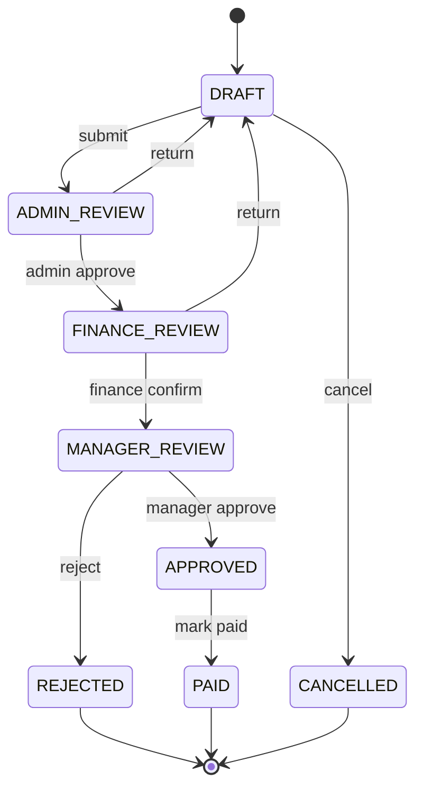

# 退費審核流程

---

## 狀態列表

| 狀態 | 說明 |
|---|---|
| DRAFT | 草稿 |
| ADMIN_REVIEW | 內勤審核中 |
| FINANCE_REVIEW | 財務審核中 |
| MANAGER_REVIEW | 主管審核中 |
| APPROVED | 已核准 |
| REJECTED | 已拒絕 |
| PAID | 已退款 |
| CANCELLED | 已取消 |

MVP 不保留 `SUBMITTED`。Sales 送出草稿後，案件直接進入 `ADMIN_REVIEW`。所有案件流程都限定在同一 Organization 內，後端需以 `organization_id` 驗證案件、客戶、專案與操作者的租戶一致性。

---

## 狀態流程

---

## 狀態轉換規則

| 目前狀態 | Action | 下一狀態 | 角色 |
|---|---|---|---|
| DRAFT | submit | ADMIN_REVIEW | SALES / OWNER |
| DRAFT | cancel | CANCELLED | SALES / OWNER |
| ADMIN_REVIEW | approve | FINANCE_REVIEW | ADMIN / OWNER |
| ADMIN_REVIEW | return | DRAFT | ADMIN / OWNER |
| FINANCE_REVIEW | confirm | MANAGER_REVIEW | FINANCE / OWNER |
| FINANCE_REVIEW | return | DRAFT | FINANCE / OWNER |
| MANAGER_REVIEW | approve | APPROVED | MANAGER / OWNER |
| MANAGER_REVIEW | reject | REJECTED | MANAGER / OWNER |
| APPROVED | mark_paid | PAID | FINANCE / OWNER |

`SYSTEM_ADMIN` 可執行平台支援操作，但仍需寫入 Audit Log。

---

## 實作原則

狀態轉換集中在 Domain 或 Service 層，不允許 Controller 直接改狀態。

每次狀態轉換需完成：

1. 驗證目前狀態。
2. 驗證 action 是否允許。
3. 驗證操作者 Organization membership、角色與資源權限。
4. 更新 `refund_cases.status`。
5. 更新時間欄位，例如 `submitted_at`、`approved_at`、`paid_at`。
6. 寫入 `refund_case_status_logs`。
7. 寫入包含 `organization_id` 的 `operation_audit_logs`。
8. 若 Dashboard 快取已啟用，清除相關快取。

---

## 終止狀態

以下狀態不可再次修改：

1. `PAID`
2. `REJECTED`
3. `CANCELLED`

若需要更正，只能由 System Admin 建立補正紀錄，不直接回改原流程。

---

## 通知事件

| 事件 | 通知對象 |
|---|---|
| 案件送出 | Admin |
| 內勤審核通過 | Finance |
| 財務確認完成 | Manager |
| 主管核准 | Finance |
| 主管拒絕 | Sales |
| 已退款 | Sales |
| 案件退回補件 | Sales |
